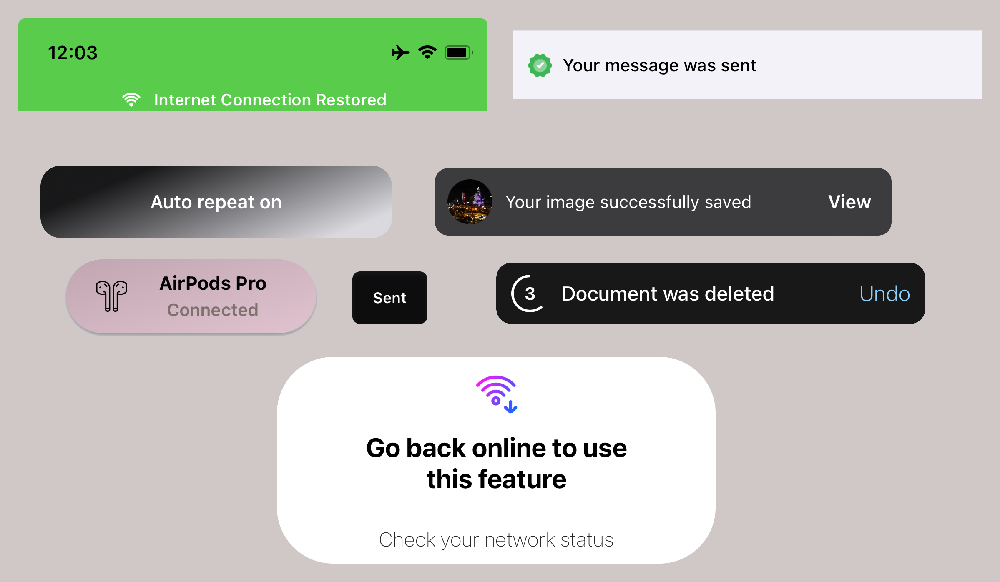

# CxjToasts 

Effortless toast presentation with various interaction behaviors between displayed toasts. CxjToasts provides an intuitive and highly customizable solution for managing toast notifications in your iOS app.



---

## Features
- **Predefined Templates**: Ready-to-use toast designs for common scenarios.
- **Customizable Toasts**: Tailor toasts to match your app's unique style.
- **Dynamic Layouts**: Adapts seamlessly to different screen configurations.
- **Easy-to-Integrate API**: Quickly add toast notifications with minimal setup.
- **iOS 14+ Compatibility**: Fully supports modern and older devices.
- **Swift Modern Concurrency**: Harness the power of Swift's async/await for toast management.
- **Flexible Animations**: Easily configurable animation options.
- **Interaction Coordination**: Smooth management of toast interaction behaviors.
- **Multiple Interaction Methods**: Supports swipe, tap, or timeout-based dismissals.
- **Haptic Feedback Support**: Enhance user experience with tactile feedback.

---

## Installation

### Swift Package Manager
You can use The Swift Package Manager to install Toast-Swift by adding the description to your Package.swift file:
```swift
dependencies: [
	.package(url: "https://github.com/coxijcake/CxjToasts", from: "1.0.0")
]
```

### CocoaPods
```swift
pod "CxjToasts"
```

---


## Example Project

To explore the full functionality of **CxjToasts**, check out the example project available in this repository. 

The example project demonstrates:
- **Predefined templates** for various toast types.
- **Customization options** for titles, icons, backgrounds, and more.
- **Dynamic animations** and interaction policies.
- **Live examples** of toast stacking, hiding, and interaction coordination.

Simply clone the repository and open the example project to see **CxjToasts** in action.

[Click here to view the example project.](https://github.com/coxijcake/CxjToasts/tree/develop/Example)

---

## Video Examples of Toast Usage

### This section demonstrates various examples of toast usage through videos. Each video showcases a specific type of toast behavior or interaction.

| Example 1         | Example 2         | Example 3         | Example 4         |
|--------------------|-------------------|-------------------|-------------------|
|  |  |  |  |
| Example 5         | Example 6         | Example 7         | Example 8         |
|  |  |  |  |

---

## Toast Configuration
The core structure for defining the behavior, appearance, and interaction of a toast. It provides a flexible API to customize animations, layout, dismissal methods, and more.

### CxjToastConfiguration 
| **Parameter**         | **Description**                                                                                                              |
|-----------------------|----------------------------------------------------------------------------------------------------------------------------|
| `typeId`             	| Identifier for the toast, used to manage interactions such as spam protection and coexistence policies. It also allows for closing all toasts with a specific `typeId`. Note: `typeId` does not equal `CxjToast.id` and is not required to be unique.          |
| `sourceView`         	| The view associated with the toast. Often used for layout calculations or interactions.                                     |
| `sourceBackground`   	| Optional background configuration for the toast. Supports touch interactions and actions.                                   |
| `layout`             	| Layout configuration for the toast, including `placement` and `constraints`.                                               |
| `dismissMethods`     	| Defines how the toast can be dismissed, such as by swipe, tap, or automatic timeout.                                        |
| `keyboardHandling`   	| Configures behavior when a keyboard is visible, such as moving the toast above it.                                         |
| `animations`         	| Animation settings for toast presentation and dismissal.                                                                    |
| `hapticFeedback`     	| Haptic feedback for the toast (e.g., success, error, or custom).                                                           |
| `spamProtection`     	| Enables or disables spam protection and defines criteria for toast comparison.                                             |
| `coexistencePolicy`  	| Defines how the toast interacts with others when a new toast is displayed.                                                 |

---

## View Configuration
Defines the visual and structural properties of the toast’s view. This configuration ensures that the toast seamlessly integrates into your app’s design and functionality.

### CxjToastViewConfiguration
| **Parameter**            | **Description**                                                                                                  |
|--------------------------|------------------------------------------------------------------------------------------------------------------|
| `contentLayout`          | Determines how the content is laid out inside the toast view (e.g., fill with insets, specific constraints).     |
| `background`             | Specifies the background style of the toast view, such as color, blur effect, gradient, or custom view.          |
| `shadow`                 | Configures the shadow appearance for the toast view.                                                             |
| `corners`                | Configures the corner style of the toast view, such as rounded or capsule.                                       |
| `isUserInteractionEnabled` | Specifies whether user interactions with the toast view are enabled.                                           |

---

## Content Configuration
Easily configure the toast content without requiring manual layout, by using pre-defined templates or providing your own custom content view to display in the toast.

### CxjToastContentConfiguration

| Case                              | Description                                                                                   |
|-----------------------------------|-----------------------------------------------------------------------------------------------|
| `.info(type:)`                    | Displays an informational toast with text or text and an icon.                               |
| `.action(config:infoContent:)`    | Displays a toast with an action (e.g., a button) and optional informational content.          |
| `.undoAction(config:)`            | Displays a toast with an undo action, such as a button to revert a previous operation.        |
| `.custom(contentView:)`           | Allows for custom content by providing a custom view implementing `CxjToastContentView`.      |

### InfoContentType

| Case                                     | Description                                                                               |
|------------------------------------------|-------------------------------------------------------------------------------------------|
| `.text(config:)`                         | Displays a text-only informational toast.                                                |
| `.textWithIcon(iconConfig:, textConfig:)`| Displays informational content with both text and an icon, configured separately.         |

---

## Licence
**CxjToasts** is available under the MIT licence. See the [LICENCE](./LICENSE) for more info.


